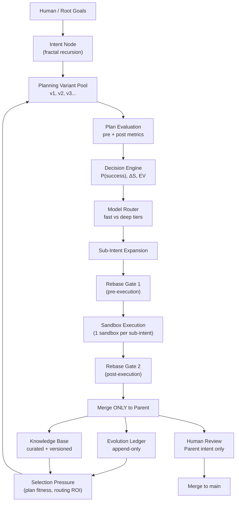

# Holon: Agentic Coder

**Git-native, sandbox-isolated, self-evolving agentic coding architecture** built around **fractal (recursive) intents**, **competitive planning variants**, **append-only learning**,
and **entropy-aware decision-making**.

Repository: [https://github.com/thomashan/holon-agentic-coder](https://github.com/thomashan/holon-agentic-coder)

---

## What is Holon?

A **holon** is something that is simultaneously a **whole** and a **part**. In this project:

- An **Intent** is a whole task to the agent working on it.
- The same Intent is also a part of a larger parent Intent.
- An **Agent** is a whole autonomous actor, and also a part of a wider evolving population.

**Holon: Agentic Coder** is a blueprint (and eventual reference implementation) for autonomous coding agents that can:

- decompose work recursively,
- generate multiple plans for the same intent,
- choose actions via explicit decision physics (success probability + entropy + EV),
- execute in isolated sandboxes,
- record *everything* in an append-only ledger,
- promote durable learnings into a curated knowledge base,
- and (long-term goal) propose their **own** intents and evaluate intent quality—earning increasing autonomy over time.

---

## Why this exists (origin story, in engineering terms)

Most agentic coding systems fail in predictable ways:

1. **State contamination:** exploration corrupts the working tree, environments drift, and "it worked once" can't be reproduced.
2. **Planning amnesia:** plans are ephemeral; the system cannot learn which planning strategies work.
3. **No causal trace:** actions are taken without a durable "why/how/what happened" record.
4. **Human review overload:** humans are asked to review noisy micro-changes rather than synthesized parent-level outcomes.
5. **No comparable variants:** there's no fair way to compare plan A vs plan B vs model choice A vs model choice B.
6. **Hidden routing:** switching between models (fast/cheap vs deep/reasoning) is treated as invisible magic instead of a measurable decision.

Holon is designed to make these failure modes structurally difficult by:

- using **Git as the universal state machine**,
- isolating exploration via **one sandbox per sub-intent**,
- capturing *intent → plan → action → result* into an **append-only Evolution Ledger**,
- treating planning as a **versioned hypothesis space**,
- and making model routing and exploration risk explicit via **entropy-aware metrics**.

---

## Core principles (non-negotiable invariants)

### 1) Intent is fractal (recursive, unbounded depth)

There is no fixed number of levels. Any intent may spawn sub-intents, which may spawn sub-sub-intents, until leaf nodes become **atomic intents** (direct actions).

### 2) Planning is first-class and competitive

For the same intent, multiple **planning variants** exist simultaneously (v1, v2, v3...). They are competing hypotheses, not edits.

### 3) Exploration is allowed because it's isolated

Low-probability and risky exploration is permitted because branches and sandboxes can be discarded. The system learns from outcomes without polluting the mainline.

### 4) Git is the universal state machine

Git provides immutable history, causal lineage, reproducibility, and cheap branching as isolation.

### 5) Strict parent-centric Git flow

- **Sub-intents merge only into their parent intent branch**
- **Never directly to `main`**
- Only **parent intents** are presented to humans for review and promotion to `main`

### 6) Mandatory dual rebase gates

Sub-intents must rebase from the latest remote parent:

- **before** execution (to avoid stale work)
- **after** execution (to resolve conflicts at the smallest semantic scope)

### 7) "Physics before intelligence"

Holon starts with weak-but-stable definitions of:

- **P(success)** (success prediction)
- **ΔS** (entropy / divergence / blast radius)
- **EV** (expected value)

These must be **comparable and explainable** before any "learning" can be meaningful.

### 8) Model routing is a first-class decision

Agents may route tasks to different models (e.g., Gemini Flash vs DeepThink). Routing choice must be:

- recorded,
- evaluated,
- and improved via selection pressure (Routing ROI).

### 9) Earned autonomy (long-term)

Agents should eventually propose their own intents and spawn sub-intents recursively—but autonomy is **earned** through demonstrated intent quality and calibration.

---

## Quick mental model

Holon has two durable stores:

- **Evolution Ledger (append-only):** the ground truth record of what was attempted and what happened.
- **Knowledge Base (curated, versioned):** distilled patterns and rules promoted from the ledger via a controlled workflow.

---

## High-level architecture



---

## Git flow (summary)

Holon enforces a strict Git discipline to ensure isolation, reproducibility, and clean human review boundaries.

**Key rules:**

- Sub-intents branch from their parent intent (never from `main`)
- Sub-intents merge **only** into their parent intent (never directly to `main`)
- Sub-intents must rebase from parent **before** and **after** execution
- Only parent intents are reviewed by humans and merged to `main` (short-term goal)

**For complete details**, see [`docs/git_flow.md`](docs/git_flow.md).

---

## Naming conventions (IDs & branches)

Holon treats identity as explicit and hierarchical. Identity is the primary key for the Evolution Ledger.

### Intent ID

An intent is generated by a specific model. Multiple models may generate competing intent proposals concurrently:

- `I-{seq}-{slug}-{model_tier}`
- Example: `I-050-refactor-metrics-flash`

### Plan ID

A plan is a versioned variant tied to an intent and the model tier used to produce it:

- `P-{intent_id}-v{variant}-{model_tier}`
- Example: `P-I-050-refactor-metrics-flash-v2-deep`

*Note: This example shows a "Deep" model planning for an intent that was originally proposed by a "Flash" model.*

### Branch naming (Fractal Nesting)

Holon uses a filesystem-like branch structure to represent the intent hierarchy. Sub-intents are nested under their parent's path.

#### Root Intent Branch

```
intent/I-root-{seq}-{slug}
```

Example: `intent/I-root-050-refactor-metrics`

#### Sub-Intent Branch (Nested)

```
intent/{parent_path}/I-{seq}-{sub_seq}-{sub_slug}
```

Example: `intent/I-root-050-refactor-metrics/I-050-001-improve-estimators`

#### Plan Branch (Execution)

Work derived from a specific plan variant occurs on a plan branch nested under the intent:

```
intent/{intent_path}/plan/{plan_id}
```

Example: `intent/I-root-050-refactor-metrics/plan/P-I-050-v2-deep`

---

## Metrics ("physics") at a glance

Holon uses simple, stable metrics early, then evolves better estimators later.

### Success prediction (P(success))

Probability that executing a plan advances the intent without violating constraints:

$$P(success) \in [0,1]$$

**Tracked:**

- **Pre-execution (predicted):** estimated before the plan runs
- **Post-execution (actual):** measured after completion (1.0 if success, 0.0 if failure)

### Entropy (ΔS)

Expected divergence / blast radius / irreversibility introduced by the plan:

$$\Delta S \in [0,\infty)$$

Entropy is a **cost signal**, not "badness". Higher entropy means:

- More files/systems touched
- More irreversible changes
- Higher conflict likelihood
- Greater novelty/uncertainty

**Tracked:**

- **Pre-execution (predicted):** estimated based on plan analysis
- **Post-execution (actual):** measured from git diff, test coverage changes, dependency graph changes

### Expected value (EV)

Combines impact, success likelihood, entropy, and cost:

$$EV = P(success) \cdot Impact - \lambda \cdot \Delta S - Cost$$

Where:

- **Impact:** estimated value delivered if the intent succeeds
- **λ (lambda):** entropy penalty weight (tunable, typically 0.1–1.0)
- **Cost:** resource consumption (tokens, time, compute)

**Used for:**

- Selecting between competing plans
- Deciding whether to continue planning (convergence)
- Evaluating agent/model performance over time

### Calibration

The system tracks **prediction accuracy** by comparing pre-execution estimates to post-execution measurements:

- **P(success) calibration:** Are agents overconfident? Underconfident?
- **ΔS calibration:** Are entropy estimates accurate?
- **Impact calibration:** Did the intent deliver expected value?

Poor calibration reduces an agent's trust level and influences future routing decisions.

**For complete formulas and bootstrap definitions**, see [`docs/metrics.md`](docs/metrics.md).

---

## Planning variants & convergence (when to stop planning)

Planning is not allowed to loop forever. For any given intent, the system may generate multiple **planning variants** (v1, v2, v3...), but must eventually **converge** and select a plan to execute.

### Why multiple variants?

Different planning approaches may yield different tradeoffs:

- **v1:** conservative, low entropy, incremental
- **v2:** aggressive, higher entropy, faster impact
- **v3:** novel approach, untested but potentially superior

Variants are **competing hypotheses**, not iterative edits.

### Convergence triggers (when to stop generating new plans)

Planning stops when any of the following conditions is met:

#### 1. EV plateau

No meaningful improvement in Expected Value after N consecutive variants:

```
if EV(v_n) - EV(v_n-1) < threshold for N iterations:
stop planning
```

Default: `threshold = 0.05`, `N = 3`

#### 2. Entropy budget exhausted

Cumulative planning cost (tokens, time, or entropy) exceeds the allocated budget:

```
if sum(planning_cost(v1...vn)) > planning_budget:
stop planning
```

Planning itself consumes resources and must be bounded.

#### 3. Dominant plan found

A plan achieves sufficiently high P(success) at acceptable ΔS:

```
if P(success) > 0.85 and ΔS < acceptable_threshold:
stop planning (high confidence)
```

#### 4. Planning cost exceeds expected return

Continuing to plan costs more than the expected gain:

```
if cost_of_next_variant > expected_EV_improvement:
stop planning (diminishing returns)
```

### Plan selection (after convergence)

Once planning stops, the system selects the plan with the **highest EV**:

```
selected_plan = argmax(EV(v1), EV(v2), ..., EV(vn))
```

All variants and their scores are recorded in the **Evolution Ledger** for future learning.

### Multi-model planning (optional)

Different models may generate plans for the same intent concurrently:

- Gemini Flash generates v1 (fast, cheap)
- Claude Sonnet generates v2 (deeper reasoning)
- Gemini DeepThink generates v3 (complex decomposition)

This enables **model routing selection pressure**: which model produces better plans for which types of intents?

**For detailed convergence policy implementation**, see [`docs/architecture.md`](docs/architecture.md) and [`docs/metrics.md`](docs/metrics.md).

---

## Dynamic model routing (captured + evolved)

Holon treats **model selection as a first-class decision** with measurable outcomes. Different LLMs (and tiers of the same LLM) may be used for different stages, including:

- intent proposal (including competing intent proposals from multiple models)
- plan generation (multiple planning variants per intent, potentially multi-model)
- execution assistance (coding, refactoring, test fixing)
- evaluation and write-up (summaries, ledger/K.B. promotion candidates)

### Why routing matters

Routing is a tradeoff across:

- capability (reasoning depth, code quality)
- latency (time to first token / completion)
- cost (tokens, $)
- risk/entropy (blast radius and irreversibility)
- novelty (unfamiliar repo areas / dependencies)

Holon makes routing explicit so routing itself can be **improved over time**.

### Routing inputs (signals)

A routing decision should be explainable and based on observable signals, such as:

- **intent complexity:** tree depth, dependency count, ambiguity
- **predicted entropy (ΔS):** estimated blast radius of the plan
- **success sensitivity:** how costly failure is (production risk, irreversibility)
- **novelty:** how unfamiliar the code region is to the system/K.B.
- **budget constraints:** time, tokens, compute limits
- **agent trust level:** permitted entropy budget and recursion depth

### Routing outputs (recorded metadata)

Every routed action records metadata into the **Evolution Ledger**, including:

- `model_id` (e.g., `gemini_flash`, `gemini_deepthink`, `claude_sonnet`)
- `agent_family` (e.g., `gemini`, `claude`)
- `routing_reason` (short explanation + key signals)
- `stage` (intent, planning, execution, evaluation)
- `token_usage`, `latency_ms`, `inference_cost_est`
- predicted vs actual outcomes (P(success), ΔS, EV impact)

This makes routing decisions **auditable** and **comparable**.

### Multi-model concurrency

Holon supports multiple models operating concurrently on the same parent intent, for example:

- competing intent proposals from different models
- parallel plan variants generated by different models
- execution assistance escalated from a fast model to a deep model when stuck

Concurrency is controlled via:

- budgets (token/time/entropy)
- convergence rules (stop when EV plateaus or dominant plan emerges)
- strict Git isolation (no direct merges to `main`)

### Routing evolution (selection pressure)

Holon improves routing by measuring which routes produce better outcomes under constraints.

Key evolving metrics include:

- **Routing ROI:** outcome quality per unit cost/latency
- **Calibration:** how accurate each model is at predicting P(success) and ΔS
- **Failure modes:** where specific models systematically underperform
- **Stage-fit:** which models do best at intent generation vs planning vs execution

Over time, the system learns:

- which model tiers are best for which intent types,
- when escalation is justified,
- and when cheap/fast planning is sufficient.

**For detailed routing policy and scoring**, see [`docs/architecture.md`](docs/architecture.md) and [`docs/metrics.md`](docs/metrics.md).

---

## Autonomous intent generation (long-term)

Holon aims for agents that can **propose their own intents** and (eventually) **spawn recursive sub-intent trees** without human initiation.

This is the most powerful—and most dangerous—capability in the system. It must be **earned**, not granted by default.

### Why autonomous intent generation?

In a fully autonomous system, agents should be able to:

- observe the codebase, ledger, and K.B.
- identify improvement opportunities (refactoring, tech debt, optimization, new features)
- propose intents with justification and predicted metrics
- decompose those intents into sub-intents recursively
- execute and learn from outcomes

This closes the loop: agents evolve the system **and** evolve themselves.

### The risk (why it must be earned)

Unconstrained autonomous intent generation can lead to:

- **runaway recursion:** agents spawn infinite sub-intents
- **misaligned goals:** agents optimize for the wrong objectives
- **resource exhaustion:** entropy budgets blown on low-value work
- **sandbox escape attempts:** agents propose intents to modify validation rules
- **chaotic exploration:** high-entropy changes with no learning value

### Earned autonomy via trust levels

Agents progress through **capability tiers** based on demonstrated performance:

| Level | Name           | Capabilities                                 | Unlock Criteria                                         |
|-------|----------------|----------------------------------------------|---------------------------------------------------------|
| **0** | **Observer**   | Read ledger, read K.B.                       | Default                                                 |
| **1** | **Proposer**   | Propose atomic intents (no sub-intents)      | 10 successful executions                                |
| **2** | **Decomposer** | Propose intents with 1 level of sub-intents  | Intent Quality > 0.7 for 20 proposals                   |
| **3** | **Architect**  | Propose intents with 2 levels of sub-intents | Intent Quality > 0.8 for 50 proposals                   |
| **4** | **Autonomous** | Unlimited recursion depth                    | Intent Quality > 0.85 for 100 proposals                 |
| **5** | **Meta**       | Can propose changes to validation rules      | Intent Quality > 0.9 for 200 proposals + human approval |

**Trust levels are per-agent** and can be **demoted** if quality degrades.

### Intent proposal mechanism

When an agent proposes an intent, it must include:

```json
{
  "proposal_id": "PROP-1738901234-x7y9",
  "proposed_by": "agent-gemini-deepthink-001",
  "agent_trust_level": 3,
  "intent_proposal": {
    "goal": "Implement caching layer for ledger reads",
    "justification": "Ledger reads are 60% of query time; caching can reduce by 80%",
    "predicted_impact": 0.85,
    "predicted_p_success": 0.75,
    "predicted_entropy": 25,
    "predicted_ev": 0.51,
    "decomposition": {
      "type": "recursive",
      "depth": 2,
      "sub_intents": [
        {
          "goal": "Design cache invalidation strategy",
          "predicted_entropy": 8,
          "sub_intents": []
        },
        {
          "goal": "Implement Redis cache adapter",
          "predicted_entropy": 12,
          "sub_intents": []
        }
      ]
    }
  }
}
```

### Proposal validation (gates)

Every proposal goes through validation checks:

#### 1. Recursion depth check

Agent's trust level determines max allowed sub-intent depth:

```python
if proposed_depth > TRUST_LEVEL_MAX_DEPTH[agent.trust_level]:
    reject("Agent level {level} limited to depth {max_depth}")
```

#### 2. Entropy budget check

Total tree entropy must fit within agent's budget:

```python
total_entropy = calculate_tree_entropy(proposal.decomposition)
if total_entropy > agent.max_entropy_budget:
    reject("Total tree entropy {total} exceeds budget {budget}")
```

#### 3. Alignment check

Sub-intents must be aligned with parent goal and system objectives.

#### 4. Novelty check

Proposal must not duplicate recent intents or violate known anti-patterns from K.B.

#### 5. Meta-proposal gate

Any proposal targeting the validation system itself requires **Level 5 + human approval**.

### Intent quality scoring (how agents level up)

After an intent completes, it receives an **Intent Quality Score** based on:

- **Impact accuracy:** Did it deliver predicted value?
- **P(success) calibration:** Was the success prediction accurate?
- **Entropy calibration:** Was the entropy estimate accurate?
- **Alignment:** Did it advance parent/system goals?
- **Efficiency:** Resource usage vs outcome quality

Agents with consistently high Intent Quality Scores earn higher trust levels and larger budgets.

### Safety mechanisms

#### Immutable core rules

Certain validation rules **cannot be modified** by agent proposals:

- max recursion depth per trust level
- entropy budget caps
- human approval requirement for Level 5
- proposal rate limits

#### Audit trail

All proposals, validations, and outcomes are logged in the **Evolution Ledger**.

#### Demotion

Agents whose quality degrades are **demoted** to lower trust levels, reducing their autonomy.

### Bootstrap path (phased rollout)

Autonomous intent generation is introduced gradually:

**Phase 1:** Human-only intent creation (bootstrap)  
**Phase 2:** Agents propose atomic intents (Level 1)  
**Phase 3:** Agents propose single-level decomposition (Level 2)  
**Phase 4:** Agents propose multi-level trees (Level 3-4)  
**Phase 5:** Exceptional agents propose meta-changes (Level 5, human-gated)

**For complete trust ladder, validation rules, and scoring formulas**, see [`docs/safety.md`](docs/safety.md) and [`docs/architecture.md`](docs/architecture.md).

---

## Status

This repository is intended to evolve from **concept + spec** into a **reference implementation**.

Current focus (recommended build order):

1. Core ID + naming + Git invariants
2. Append-only ledger schema + writer
3. Planning variant representation + scoring stubs
4. Convergence policy
5. Sandbox executor harness
6. Model routing + routing ROI capture
7. Autonomy proposals + trust ladder enforcement

---

## Documentation map

- [`docs/agent_design.md`](docs/agent_design.md) — high-level agent architecture and behavioral contracts
- [`docs/agents.md`](docs/agents.md) — how to plug in agents (Claude Code, Gemini CLI, others)
- [`docs/architecture.md`](docs/architecture.md) — full technical design
- [`docs/core_concepts.md`](docs/core_concepts.md) — fundamental terminology and metrics
- [`docs/examples.md`](docs/examples.md) — end-to-end walkthroughs
- [`docs/git_flow.md`](docs/git_flow.md) — strict branching/rebase/merge rules
- [`docs/knowledgebase_schema.md`](docs/knowledgebase_schema.md) — propose/validate/promote workflow
- [`docs/ledger_schema.md`](docs/ledger_schema.md) — record types, JSON schemas
- [`docs/metrics.md`](docs/metrics.md) — formal definitions of P(success), ΔS, EV, calibration
- [`docs/planning_and_evaluation.md`](docs/planning_and_evaluation.md) — planning lifecycle, variant evaluation, convergence policies
- [`docs/safety.md`](docs/safety.md) — budgets, trust ladder, immutable rules, auditability

---

## Contributing

This project is currently in the **ideation and planning phase**. The focus is on refining the conceptual architecture, principles, and specifications—not implementation.

Contributions are welcome in the form of:

- **Conceptual feedback:** challenging assumptions, identifying edge cases, proposing alternative approaches
- **Documentation improvements:** clarity, completeness, consistency across specs
- **Theoretical refinement:** better metrics definitions, convergence policies, safety mechanisms
- **Use case analysis:** how this architecture would handle specific real-world scenarios

Please open **issues** or **discussions** for:

- questions about design decisions
- proposed changes to core principles
- identification of gaps or contradictions in the spec

**Note:** This repository is a **blueprint and specification**, not a reference implementation. There are no plans to accept implementation PRs at this time.

---

## How to cite / describe Holon (one paragraph)

Holon: Agentic Coder is a git-native architecture for autonomous coding agents that models work as a recursive tree of intents, evaluates multiple planning variants per intent, executes sub-intents in isolated sandboxes
with mandatory rebasing, records all intent/action/outcome data in an append-only evolution ledger, curates learnings into a versioned knowledge base, and treats success prediction, entropy, and model routing as
first-class measurable signals driving selection pressure and earned autonomy.

---

**Next:** See [`docs/architecture.md`](docs/architecture.md) for the complete technical design.
